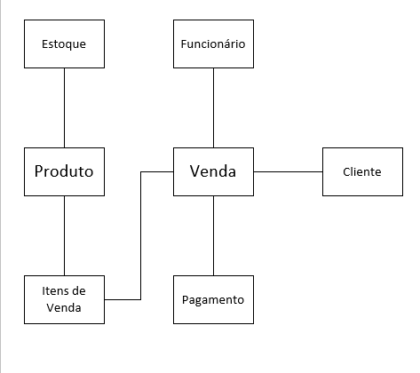
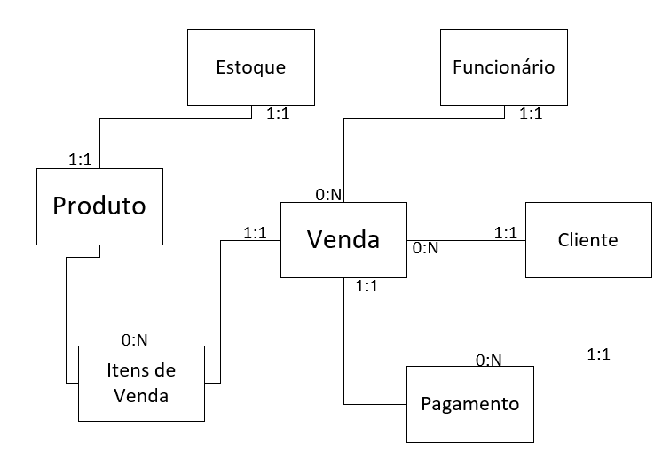
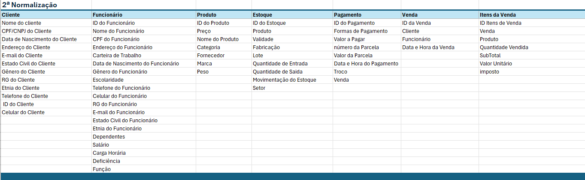
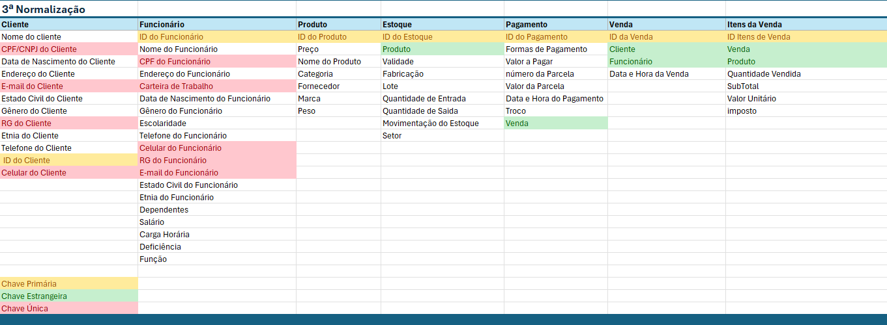
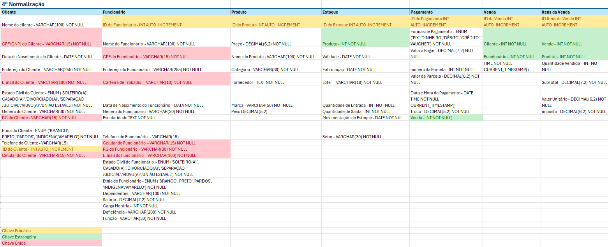

# Casa Oliveira
## Estudo de Caso

Roberto é dono de um mercado no bairro de Vargem Grande, na cidade de 
Tupã. Ele herdou o negócio de seu pai, Gumercindo Oliveira. O negócio 
iniciou em 1978 na garagem da casa da família, era uma pequena quitanda. 
Com o passar dos anos, o negócio cresceu, e Gumercindo mudou-se para 
um local maior, onde permaneceu até os dias atuais.
Roberto, o novo dono do mercado, continuou o negócio da mesma forma que 
o pai. Ele comprava grandes volumes de produtos diretamente com os 
fornecedores e os armazenava em seu estoque. Às vezes, ele comprava 
muitos produtos mesmo já tendo estoque, o que causava uma sobrecarga. 
Além disso, tinha muitos produtos estragados, tais como: frutas, legumes, 
iogurtes, leites, frango, etc. Também havia muitos produtos com o prazo de 
validade vencido.

Os funcionários eram poucos e faziam muitas coisas ao mesmo tempo. O 
açougueiro também ajudava no estoque; a moça da limpeza ajudava na 
organização dos produtos das prateleiras, além de auxiliar na padaria. 
Quando o caixa estava vazio, o operador ajudava a repor os laticínios e a 
limpar a loja. O repositor também trabalhava no caixa. 

Ao realizar a venda, Roberto, que sabia o nome de quase todos os clientes, 
anotava em um caderno todos os produtos vendidos e o que havia em 
estoque. Ao fim do dia, ele pegava o caderno e fazia os cálculos de quanto 
havia vendido, somando o faturamento e atualizando o estoque. Esse 
processo é feito todos os dias e toma um tempo considerável para ser concluído.

Roberto fechava a loja às 18h, mas só ia para casa às 22h, após fazer todas 
as operações necessárias. Mesmo assim, o negócio vai bem, e Roberto 
pretende mudar-se para outro ponto, aumentar o volume de negócios e 
contratar novos funcionários.

Márcia, esposa de Roberto, vem conversando com ele há muito tempo para 
que contrate uma empresa para construir um sistema de informática para 
gerenciar o negócio. O objetivo é reduzir o tempo que ele passa trabalhando, obter melhor organização dos produtos, maior lucratividade e melhorar a 
gestão.

Com a intenção de aumentar o negócio, Roberto está disposto a informatizar 
sua empresa. Vamos ajudá-lo. Começaremos construindo o banco de dados

### Elementos Levantados 

- Estoque
- Funcionário
- Venda
- Cliente 
- Pagamento
- Produto
- Itens de Vendas

### Modelo Conceitual

### Modelo Relacionamento

### Normalizações

#### Normalização 1

#### Normalização 2

#### Normalização 3

#### Normalização 4
